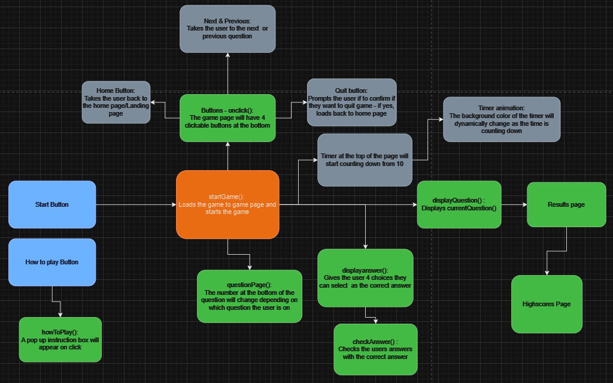
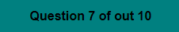

# QuizTion - The General Knowledge Quiz Game

# Overview

QuizTion is an exciting and fun quiz game that challenges its users on their general knowledge. This Quiz site is for people who want to who are interested in testing themselves on the general topics of the world.

This website is to be passed as my second Project portfolio for Code Institutes Fullstack development course.

[Click here to view live website](https://jefferson-bantawig.github.io/QuizTion-Quiz-Game/)

## Core Purposes of the website

This website is made for people who want to challenge themselves on the general topics of the world. Users will be able show off their knowledge and also learn from all the carefully curated questions. The questions on this website were meticulously crafted to provide users with a though-provoking challenge, designed to give unexpected answers.

# UX Design

## User Stories

### As a first time user

- I want to see a unique and uniform design and color scheme.
- I want a responsive site that will accomodate all screen sizes.
- I want buttons that work as they are supposed to.
- I want a how to play section that gives instructions on how to play the game.
- I want to get an indication as to what question I am currently and and how many questions i have left.
- I want to be able to see my score during and after the quiz.
- I want to see an indication on whether i got a correct or wrong answer.
- I want to see a leaderboard feature to which i can add my own name if i get a high score.

### As a returning user

- I want to experience a refreshed and randomized order of questions in each game to prevent memorization and maintain the element of surprise.
- I want the option to view the leaderboard and see the current top scorers.
- I want the site to be compatible to different devices in times i want to play on the go.

### This Website will be accessible to all devices and screens

# Structure

## Landing page

- Uses the visually appealling color combination of Salmon and Teal colors to provide a sense of sophitication and warmth.
- Provides a minimalist design that features just 2 buttons, eliminating unnecessary complexity and a straighforward experience.
- Contains a modal feature that pops up, containing a set of instructions when the "how to play" button is clicked.

### User Goal

  > - Appreciate the unique design of the site.
  > - Seamless and straighforward user experience.
  > - Easy access to the start game and instructions menu.
  > - Short and concise set of instructions.

### Website Goal  
  
  > - Captivate the player by using warm and sophisticated color patterns and design.
  > - Eliminate overcomplexity in the design to focus more on the purpose of the website.
  > - Provide a pop up modal feature that users can click to read the instructions on how to play the game.
  > - A responsive design that accomodates different screen sizes.

### Title Section

- The title section is strategically placed centered and at the top of the page.
- The bold and eye-catching design draws the users eyes immediately to the name of the quiz game.
- The choice of adding a stroke around the text adds a more impactful effect to the user.
- A small sentence is found underneath the header. This gives the users a small description of what to expect from the website.
- The box shadow around the title section makes the title pop and give a 3 Dimensional feel.
- Two buttons following the design of the title section are placed in the game menu section.
- A hover style is added to the buttons. The opacity of the buttons changes during hovering to give the user a more interactive feel.
- A pointer was also assign to prompt the user that the buttons are clickable.
- A modal feature is added in the how to play button.
- The modal pops up as the button is clicked and displays the instructions on how to play the game.
- The teal color accent of the instructions heading was a stylistic choice of the programmer.
- The modal contains a set of text that instructs the users how the quiz is played. The "QuizTion" words are purposefully designed differently to add emphasis to the quiz's name.
- A close button is located at the buttom of the modal for easy access in closing the modal.
- The modal takes approximately 50% of the whole viewport, dimming the remaining area outside the modal. Upon closing the modal, the dimming effect is lifted.
- A border and border-radius around the modal makes it consistent with the design of the website.

## Game Page

### User Goals
  
  > - Get feedback when getting correct and wrong anwers.
  > - Know what question I am currently on and how many more I have left.
  > - Have a score tracker to monitor how well I am doing with the quiz.
  > - A quit button to click that ends the game whenever I want to.

### Website Goals
  >
  > - Provide a randomized set of questions everytime to maintain the element of surprise.
  > - Provide a progress bar feature to help the user track their progress during the quiz.
  > - Stimulate the users brain by providing challenging questions that require a bit of thinking.
  > - Provide a sophisticated design that helps to keep user engaged the whole time.

### Game Section

- The game section is set to reveal upon clicking the Start button, utilizing CSS display styling toggling between "block" and "none." This approach minimizes any lag time between the button click and the display of the questions.
- The top part of the game section contains the progress bar. The bar progresses with each displayed question. This gives the user an idea on how they are progressing throughout the game.
- Inside the progress bar is the score counter. Starting from zero, the user can track their score as they progress through the game. This score counter will dynamically change as the user selects the correct answer, and will remain the same if they choose the wrong one.
- Below the progress bar is the term "QuezTion" along with the question number. This play on words combines the word "question" and a playful twist on the websites name, "QuizTion". This is done in hopes to provide a lighthearted moment from the user.
- Under the question number is the actual question. The smokey white color helps it pop but not overshadow the other texts on the screen.
- These questions were programmed to give a random sequence of question evertime, this is done to help maintain an element of surprise.
- Each choices in the choices section is contained in a retangle box. Labeled from a to d, each letter corresponds to a specific answer that the user can click.
- A hover animation is added to the choices. When a choice is hovered, it elevates upward and is given a subtle boxshadow in order to make and interactive experience.
- A question tracker can be seen in small black print under the choices section. This gives the information on what question the user is on and how many more will they have to answer.
- Two buttons can be seen at the bottom of the viewport, a home button with a favicon of a house, and a Quit button, each located at opposite corners of the page.
- The home button takes the user back to the landing page, and the quit button links to the highscores page.
- A color effect is added, if a player selects the correct answer the background of the whole page will change to a green color, and a wrong answer will trigger a red color. This adds a visual feedback and maintains user engagement.

## Results Page

### User Goals
  
  > - A result page that shows me my final score.
  > - An input that allows me to add my name and save my scores.
  > - Buttons in the result page that can record and view highscores.
  > - A button that allows me to play again.

### Website Goals
  
  > - Provide a results page where users can see and add their names and scores.
  > - The highscore leaderboard feature provides a sense of competition between users, where only the top 5 highest scorers are featured.
  > - A clickable button allowing the player to play a new game.

### Results Section

- The results section follows the design of the landing page, with a heading section containing the name of the website. This adds a sense of uniformity throughout the site.
- Underneath is a section displaying the players score, which corresponds to how many correct answers they got.
- The user is given an input box, where they can enter their name and save their score to get placed in the leaderboard.
- Three buttons are located at the very bottom of the container. Save score, Highscore, and Play again.
- The Save button is programmed to be disabled if the user does not input their name, once an input is added, this will then save the players name and score and add it to the leaderboard.
- Highscore button links the player to the highscores page.
- The Play again button links the player back to the landing page.

## Highscore Page

### User Goals

 > - See a consistent design and color scheme throughout the whole game.
 > - Have a leaderboard section that features the highest scoring players.
 > - A button that will take me back to the start of the page.

### Website Goals

> - Provide a consistent and uniformed color palette and design throughout,
> - Add a highscore feature that saves the users scores and features 5 of the highest scoring players.
> - A home button that links the user back to the start of the game, and be able to start a fresh game.

### Leaderboard Section

- This section follows a uniform design with the rest of the site.
- The heading section contains the words "Top Players" that showcases the names and scores of the top 5 highest scoring players.
- This adds a sense of competition between the users, motivating them to strinve for a spot in the top 5 of the leaderboard.
- Under the heading is the actual list of players that have the highest scores.
- Listed from 1 - 5, with the highest score being placed at number 1.
- A home button placed at the bottom of the page takes the player back to the start of the game.

## Wireframe

- There are a few minimal design changes from the initial design. Adding an accent smokey white color seemed to look a lot better in my opinion.

## Flowchart

- This was the initial flowchart made before i started any code.
- I tried to stick to following the flowchart as much as possible. However i encountered situations where additional functions were necessary during the coding process for the website. These functions were not initially anticipated but were discovered as the website developed.

## Design

QuizTion is tailored for individuals seeking to challenge their knowledge across various global subjects. It caters to those with a competitive spirit, providing an opportunity to etch their name at the summit of the leaderboards.

## Color Scheme

A warm and appealing color combination of teal and salmon helps to capture the users visual interest. An accent of Ivory and Black helps the main colors standout without overshadowing them. A bright green color effect when a correct answer is chosen helps add a visual cue and provides immediate feedback to the user. The same can be said for the red color when choosing the wrong answer.

### ** Background Colors ** 

  
> ## Teal
> Main background color, Color for How to play heading, Final score, close button, Save score button, Highscore button and Play again button.
> Represents Sophistication and balance. The main color theme for the site, helps keep the users visual interest.  

  
> ## Salmon
> The main color accent of the website. Color for heading section background, start game and how to play buttons, modal background, question text, progress bar, Letter choices, home and quit button, results container, highscores container.
> Represents warmth, comfort and sophistication. Perfectly complements the main background color.  
> 
  
> ## Ivory
> Color for the main text of the website, background color for the choices.
> Represents elegand and warmth.  
> 
  
> ## Black
> Accent color for ivory. Complements the overall color scheme of the website but does not standout.  

  
> ## Engineering Orange
> Background color effect when getting a wrong answer.
> This color was better for the eyes compared to red in my opinion.  

  
> ## Green
> Background color effect for Correct answer.
> This is the universal color for a correct or right choice.

### Typography
[Inter](https://fonts.google.com/specimen/Inter?query=inter), 
[Raleway](https://fonts.google.com/specimen/Raleway?query=raleway), 
[Jost](https://fonts.google.com/specimen/Jost?query=jost)
- A font family of Inter, Raleway, and Jost were chosen for this website. 
- The 3 similar fonts were chosen because of the peculiar design of the letter "Q" which is one of the most recognizeable letter througout the website.

## Visual Effects

### Shadows

The Main heading, buttons, choices and highscore containers, are wrapped inside boxes. In order to make this standout, a box shadow effect was added. This also aids in providing a 3D effect.

### Modal

A modal feature is added in the how to play section. A pop up modal is displayed when the how to play button is clicked. Following the color scheme of the site makes is more pleasing to look at.

### Hover 

A hover effect and a pointer cursor is added to all the buttons in the website to add a more interactive feel to the game.

When hovered a box shadow effect is added to the choices, it also translates upwards a few pixels to for a more interactive feel. 

### Answers Feedback

Two different color changes can be noticed in the background whenever a player chooses an answer. It changes to green and red depending if the player chooses the correct of wrong answer. This visual cue helps to keep user engagement.

___

# Features
 ## Landing Page
 

The landing page contains a simple design of the main website Title/name, and a small description of what the website is about. This minimalistic design offers a pleasing uncluttered view, emphasizing simplicity and a clean aesthetic.

 ## Modal
 

 The modal section contains a feature that pops up containing the game instruction. The name of the game is emphasized by higlighting in a different color. The close button is located at the bottom for easy access to the user.

 ## Game Page
  

 The game page exudes a minimalistic feel with its uniform and simple design. The simple design does not overshadow the main purpose of the site of a quiz challenge.
 
 The Game page is programmed to display a random question every game. This helps keep an element of surprise.

 

 The bottom of the page contains a question counter that cues the user what question they are currently on, and how many questions they have left to answer.

 ## Progress bar
 
 
 

 This dynamic progress bar is programmed to fill up depending on what question the user is at. Starting from an empty bar at question 1 and ends fill a full bar at the last question.

 The progress bar also contains the score tracker, which dynamically adds a score everytime the player selects the correct answer, but does not add or minus any points for choosing the wrong answer.

## Results Page

After the user completes answering the 10 questions, they will be taken to the results page where their score is displayed. They will then be promted to enter their name in order to save their score and get a chance to place in the leaderboard.

The highscore button will link the player to the highscores page, where they can see all the top scoring players of the game. 

## Leaderboard

The leaderboard feature tracks the scores of all the players. It is programmed to display only the top 5 highest scoring players, with the highest score being placed at 1.

A home button is placed at the bottom of the page for easy access back to the landing page.

## Reponsive Design

The website is designed to be responsive. The responsive design occurs seamlessly thanks to the utilization of flex box and media queries. The design of the website was first initiated on a 280x653 resolution which is one of the more common screen resolution for smartphones. There is a clear difference between the texts when viewed in smaller devices, the stroke on the letters as well as the bold design is opted out inorder to save screen real estate. The responsive design was also tested in other common screen resolutions such as 320px for mobile, 375px, 425px, 768px, 1024px and 1440px. Each is resolution designed to look balanced and aesthetically pleasing to all devices.

## Future Considerations

It felt like there were more features I could have added to this website, however due to time constraints and personal reason, i wasn't able to dedicate as much time to this project as i had initially hoped. 
The considerations that i am hoping to change in the future are:

- To add more sets of questions to entice the users to return for more.
- Add a difficulty level, which separates the levels form easy, medium and hard difficulty.
- 
- Separate a highscores page for each of the difficulty levels.
- Add more images throughout the site to help with user engagement.
- A timer function that counts down to add pressure to the users when answering.
- A loading animation that cues the uses when the page is loading.

# Technologies
  - HTML for the structure of the website. 
  - CSS to add design and styling to the website.
  - Google lighthouse to test for acessibility and loading of the webpage.
  - Chat gpt for helping me understand some of the code concepts i found difficult
  - [CodeAnywhere](codeanywhere.com) IDE for developing website.
- [Github](https://GitHub.com/) to host the source code and deploy and host live site and for version control.
- [FontAwesome](https://fontawesome.com/) Icons.
- [Google Fonts](https://fonts.google.com/) For Typography.
- [Chrome Developer Tool](https://developers.google.com/web/tools/chrome-devtools) For debugging and testing layouts.
- [flaticon](https://flaticon.com/) For the website icon
- [Coolors](https://coolors.co/) For choosing website color palette.
- [Figma](https://figma.com/) For wireframe design.
- [Draw.io](https://draw.io/) For the workflow design.
- [W3C HTML Markup Validator](https://validator.w3.org/) to validate HTML code.
- [W3C Jigsaw CSS Validator](https://jigsaw.w3.org/css-validator/) to validate CSS code.
- [Jshint Validator](https://jshint.com/) to validate javascript code
- [Tables Generator](https://www.tablesgenerator.com/) to help generate markdown table for this readme
___

# Testing and Validation

This website was tested using the Chrome developer tool and through manual testing. Links and buttons were manually check multiple times. The website was submitted to the "peerscodereview" channel of codeinstitutes slack group, to help spot any bugs.

| Test                         | Desired Outcome                                                          | Result |
|------------------------------|--------------------------------------------------------------------------|--------|
| Start Game                   | Initiates Start game function                                            | Pass   |
| How To play                  | Instruction modal pop up                                                 | Pass   |
| Close modal button           | Closes the instructions modal                                            | Pass   |
| Choice letter A              | Selects choice letter A                                                  | Pass   |
| Choice letter B              | Selects choice letter B                                                  | Pass   |
| Choice letter C              | Selects choice letter C                                                  | Pass   |
| Choice Letter D              | Selects choice letter D                                                  | Pass   |
| Progress Bar                 | Dynamically Changes depending on the question number                     | Pass   |
| Score Tracker                | Adds 1 point everytime a correct answer is chosen                        | Pass   |
| Home Button                  | Redirects to Landing page                                                | Pass   |
| Quit Button                  | Redirects to Highscores page                                             | Pass   |
| Correct answer effect        | Background color changes to green when a correct answer is chosen        | Pass   |
| Wrong answer effect          | Background color changes to red when a wrong answer is chosen            | Pass   |
| Question Counter             | Changes the number of the question starting from 1 upto 10               | Pass   |
| Random Question function     | Sets a random order of questions new every game                          | Pass   |
| Save score disable           | Save score is disabled if the user does not input a name in the text box | Pass   |
| Highscore button             | Redirects to highscores page                                             | Pass   |
| Save score button            | Redirects to highscores page when an input is typed in the text box      | Pass   |
| Home button(Highscores Page) | Redirects to landing page                                                | Pass   |
| Play Again button            | Redirects to Landing page and allows user to start a new game            | Pass   |

1. **W3 Markup Validation - HTML Landing Page**

2. **W3 Markup Validation - HTML Results Page**

3. **W3 Markup Validation - HTML Results Page**

4. **Css Validator Results**

5. **Google Lighthouse Results**
   
   **Landing Page**

   Mobile  
   

   Desktop  
    

   **Results Page**

    Mobile  
   

   Desktop  
    

    **Highscores Page**
   
    Mobile  
   

   Desktop  
    

# Problems & Bugs Encoutered

- I encounted a few problems throughout the making of this project. The number 1 was codeanywhere not working most of the time. It became very frustrating alot of the times, because of work, i can only spend so much time on my project, so codeanywhere not working does make an impact on the quality of my project. I had to destroy and redeply my workspaces at least twice because i had a problem with pushing my code to git hub. This is why i have so few commits in github, as i had to resort in using VScode and pasting my code once codeanywhere was up and running.  I might explore other IDE's for future projects.
  
- A bug that i had trouble fixing was my initial timer function. I have spent atleast 3 days trying to debug why my timer did not count down properly after a question was clicked. Because of the limited time i had before this project was due, i decided to abandon the feature and hope to come back to it and make it work in the future.

# Deployment

 This project was deployed using GitHub, The steps I made were as follows:

1. Logged in to GitHub.com.
2. Selected QuizTion-Quiz-Game from the repositories.
3. Clicked settings from the subheadings in the repository.
4. Clicked the pages menu under the Code and automations section located on the left side of the screen.
5. Selected "main" in the dropdown menu under the source heading.
6. Selected "root" on the next dropdown menu.
7. Clicked save.
8. Waited for a few minutes and refreshed the page.
9. Went back to my QuizTion-Quiz-Game repository.
10. Clicked Deployment tab in the right side of the page.
11. Clicked the link under GitHub pages.

# How to Clone the repository

1. Go to the GitHub repository Jefferson-Bantawig/QuizTion-Quiz-Game.
2. Click the code dropdown menu highlighted in green.
3. Copy the link under the HTTPS heading.
4. Open IDE of your choice and open the terminal.
5. Type in "git clone" and paste the copied link.
6. You will now have a clone of this repository.

# Acknowledgements

- I would like to thank my Mentor Ronan McClelland for his guidance on making my this project, he helped me come up with some features for my quiz game and pointed me to the right direction.

- I would like to thank the slack community in helping me with any questions that I had.

- I would like to say thank you to the tutors at codeinstitute for their patience and guidance whenever i had trouble understanding something.

- I would like to thank the people in the peer-code-review channel in code institute, who were kind enough to share some of their comments and tips regarding my website.
  
- I would like to thank my girlfriend Yvy for  her patience and support throughout my course.
  
# Credits

I watched a lot of videos about coding a quiz game in Javascript. I would like to give credits to the people listed below: 

   1. [Web Dev Simplified](https://www.youtube.com/watch?v=riDzcEQbX6k&list=LL&index=9&ab_channel=WebDevSimplified) For the hide/unhide funtion of my game

   2. [James Q Quick](https://www.youtube.com/watch?v=IK257Ln0MZc&list=LL&index=11&t=164s&ab_channel=JamesQQuick) For the design inspiration and how to call and set up functions and progress bar.

   3. [Kevin Powell](https://www.youtube.com/watch?v=TAB_v6yBXIE&t=78s&ab_channel=KevinPowell) For his amazing explanation on modals.
   
   4. [Chart Js](https://www.youtube.com/watch?v=xVMkFJZhZYU&list=LL&index=8&t=248s&ab_channel=ChartJS) For helping me understand with creating buttons and button links
   
   5. [Code bro](https://www.youtube.com/watch?v=lfmg-EJ8gm4&list=LL&index=11&t=16085s&ab_channel=BroCode) For his easy to understand course on Javascript.

